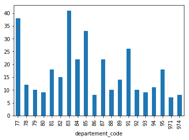

# Annuaire de constructeurs de maisons individuelles
## Petite exploration de données


```python
# Importation de package
%matplotlib inline
import matplotlib.pyplot as plt
import pandas as pd

#%cd ../../data/

# Chargement du fichier CSV
df = pd.read_csv('constructors_annuaire.csv', sep=';')

df.index.name = '_id'
# Les 20 derniers constructeurs de la DataFrame
df.sort_values(by=['departement_code']).tail(20)
```


<div>
<style>
    .dataframe thead tr:only-child th {
        text-align: right;
    }

    .dataframe thead th {
        text-align: left;
    }

    .dataframe tbody tr th {
        vertical-align: top;
    }
</style>
<table border="1" class="dataframe">
  <thead>
    <tr style="text-align: right;">
      <th></th>
      <th>intitule</th>
      <th>region</th>
      <th>departement</th>
      <th>departement_code</th>
      <th>address</th>
      <th>phone</th>
      <th>website</th>
    </tr>
    <tr>
      <th>_id</th>
      <th></th>
      <th></th>
      <th></th>
      <th></th>
      <th></th>
      <th></th>
      <th></th>
    </tr>
  </thead>
  <tbody>
    <tr>
      <th>767</th>
      <td>Maisons BERVAL</td>
      <td>Île-de-France</td>
      <td>le Val-d'Oise</td>
      <td>95</td>
      <td>Route Nationale 1   95570 MOISELLES</td>
      <td>0139918686</td>
      <td>http://www.maisonsberval.fr/</td>
    </tr>
    <tr>
      <th>766</th>
      <td>Maisons Arlogis</td>
      <td>Île-de-France</td>
      <td>le Val-d'Oise</td>
      <td>95</td>
      <td>27, avenue de la Constellation - BP 48557  958...</td>
      <td>0134350271</td>
      <td>http://www.valdoise.arlogis.com/</td>
    </tr>
    <tr>
      <th>765</th>
      <td>MAISON EN LIGNE</td>
      <td>Île-de-France</td>
      <td>le Val-d'Oise</td>
      <td>95</td>
      <td>53 rue Edouard Bourchy 95260 BEAUMONT-SUR-OISE</td>
      <td>0134708642</td>
      <td>http://www.maisonenligne.fr</td>
    </tr>
    <tr>
      <th>771</th>
      <td>Domexpo - Village Ballet Moisselle</td>
      <td>Île-de-France</td>
      <td>le Val-d'Oise</td>
      <td>95</td>
      <td>Route Nationale 1   95570 MOISELLES</td>
      <td>NaN</td>
      <td>http://www.domexpo.fr/</td>
    </tr>
    <tr>
      <th>768</th>
      <td>JPC Construction</td>
      <td>Île-de-France</td>
      <td>le Val-d'Oise</td>
      <td>95</td>
      <td>25, rue de Gisors   95300 PONTOISE</td>
      <td>0134250765</td>
      <td>http://www.jpc-construction.fr/</td>
    </tr>
    <tr>
      <th>520</th>
      <td>MAISONS CARIBOIS</td>
      <td>Départements d'Outre Mer</td>
      <td>la Guadeloupe</td>
      <td>971</td>
      <td>25 Parc d'Activités de Jabrun 97122 BAIE MAHAULT</td>
      <td>0590950489</td>
      <td>http://www.caribois.com</td>
    </tr>
    <tr>
      <th>521</th>
      <td>objectif maison</td>
      <td>Départements d'Outre Mer</td>
      <td>la Guadeloupe</td>
      <td>971</td>
      <td>13, résidence convenance gate 97122 BAIE-MAHAULT</td>
      <td>0590324320</td>
      <td>http://www.objectifmaison.fr/</td>
    </tr>
    <tr>
      <th>522</th>
      <td>Les VILLAS KéOPS</td>
      <td>Départements d'Outre Mer</td>
      <td>la Guadeloupe</td>
      <td>971</td>
      <td>19 Lot Ti Savann BLD du Lamentin 97122 BAIE MA...</td>
      <td>0590320109</td>
      <td>http://www.villaskeops.com</td>
    </tr>
    <tr>
      <th>523</th>
      <td>VILLARCHIPEL</td>
      <td>Départements d'Outre Mer</td>
      <td>la Guadeloupe</td>
      <td>971</td>
      <td>Sci Les Tropiques Voie Verte 97122 BAIE MAHAULT</td>
      <td>0590950000</td>
      <td>http://www.villarchipel.com</td>
    </tr>
    <tr>
      <th>524</th>
      <td>Maisons Keops</td>
      <td>Départements d'Outre Mer</td>
      <td>la Guadeloupe</td>
      <td>971</td>
      <td>19, Lot Ti-Savann  97122  BAIE MAHAULT</td>
      <td>0590320109</td>
      <td>http://www.maisonskeops.com/</td>
    </tr>
    <tr>
      <th>525</th>
      <td>Villarchipel</td>
      <td>Départements d'Outre Mer</td>
      <td>la Guadeloupe</td>
      <td>971</td>
      <td>Immeuble Les Tropiques - Voie Verte - ZI Jarry...</td>
      <td>0590252442</td>
      <td>http://www.villarchipel.com/</td>
    </tr>
    <tr>
      <th>526</th>
      <td>Coverdis Antilles - Polytuil</td>
      <td>Départements d'Outre Mer</td>
      <td>la Guadeloupe</td>
      <td>971</td>
      <td>46, rue de la Chapelle - Jarry 97122 BAIE-MAHAULT</td>
      <td>0590321000</td>
      <td>http://www.polytuilantilles.com</td>
    </tr>
    <tr>
      <th>529</th>
      <td>VILLAS BOURBON BOIS</td>
      <td>Départements d'Outre Mer</td>
      <td>La Réunion</td>
      <td>974</td>
      <td>6 Bis, rue Léopold Rambaud 97490 SAINTE-CLOTILDE</td>
      <td>0262909052</td>
      <td>http://www.villas-bourbonbois.com</td>
    </tr>
    <tr>
      <th>534</th>
      <td>MAOI</td>
      <td>Départements d'Outre Mer</td>
      <td>La Réunion</td>
      <td>974</td>
      <td>49, rue Etienne Régnault 97411 SAINT-PAUL</td>
      <td>+262693478927</td>
      <td>http://https://www.maoi.re</td>
    </tr>
    <tr>
      <th>533</th>
      <td>MLD Construction Sarl</td>
      <td>Départements d'Outre Mer</td>
      <td>La Réunion</td>
      <td>974</td>
      <td>6 impasse la ouate 97438 SAINTE MARIE</td>
      <td>0262415196</td>
      <td>http://www.mldconstruction.re</td>
    </tr>
    <tr>
      <th>532</th>
      <td>VILLAS BOURBON BOIS</td>
      <td>Départements d'Outre Mer</td>
      <td>La Réunion</td>
      <td>974</td>
      <td>15 Bis r Victor Le Vigoureux 97410 SAINT-PIERRE</td>
      <td>0262909058</td>
      <td>http://www.villas-bourbonbois.com</td>
    </tr>
    <tr>
      <th>531</th>
      <td>VILLAS BOURBON BOIS</td>
      <td>Départements d'Outre Mer</td>
      <td>La Réunion</td>
      <td>974</td>
      <td>6 route Savannah 97460 SAINT PAUL</td>
      <td>0262909056</td>
      <td>http://www.villas-bourbonbois.com</td>
    </tr>
    <tr>
      <th>530</th>
      <td>VILLAS BOURBON BOIS</td>
      <td>Départements d'Outre Mer</td>
      <td>La Réunion</td>
      <td>974</td>
      <td>19 chem Hubert Delisle 97470 SAINT-BENOIT</td>
      <td>0262909054</td>
      <td>http://www.villas-bourbonbois.com</td>
    </tr>
    <tr>
      <th>528</th>
      <td>VILLAS BOURBON BOIS</td>
      <td>Départements d'Outre Mer</td>
      <td>La Réunion</td>
      <td>974</td>
      <td>2, rue Camille Desmoulins 97420 LE PORT</td>
      <td>0262909050</td>
      <td>http://www.villas-bourbonbois.com</td>
    </tr>
    <tr>
      <th>527</th>
      <td>Société Réunionnaise de Construction Artisanale</td>
      <td>Départements d'Outre Mer</td>
      <td>La Réunion</td>
      <td>974</td>
      <td>20, rue Jean Cocteau   97490 SAINTE CLOTILDE</td>
      <td>0262902929</td>
      <td>http://www.sorecar.fr/</td>
    </tr>
  </tbody>
</table>
</div>


```python
# Total de constructeurs sur tous les départements
df.intitule.count()
```


    1733


```python
# Nombre de constructeurs
df.intitule.nunique()

# 844 < 1733 car un constructeur peut être présent dans plusieurs dépts.
```


    844


```python
# Constructeurs par département

constr_dept = df.groupby(df.departement_code).intitule.count()#.tail(20).plot.bar()
constr_dept
```


    departement_code
    1      33
    2      13
    3      15
    4      13
    6      13
    7      12
    10     14
    11     20
    12     10
    13     33
    14     18
    15      5
    16     20
    17     35
    18     18
    19     15
    21     15
    22     19
    23      7
    24     23
    25     15
    26     22
    27     44
    28     14
    29     18
    30     19
    31     40
    32      7
    33     58
    34     26
           ..
    66     18
    67     14
    68     16
    69     41
    71     19
    72     15
    73     15
    74     20
    75     18
    76     60
    77     38
    78     12
    79     10
    80      9
    81     18
    82     15
    83     41
    84     22
    85     33
    86      8
    87     22
    88     10
    89     14
    91     26
    92     10
    93      9
    94     11
    95     18
    971     7
    974     8
    Name: intitule, Length: 87, dtype: int64


```python
# Constructeurs par département : représentation graphique des 20 derniers départements
const_dept.tail(20).plot.bar()

```


    <matplotlib.axes._subplots.AxesSubplot at 0x7f78b77a9710>





```python
# Les 10 départements où sont insttalés le plus de constructeurs
const_dept.sort_values(ascending=False).head(10)
```


    departement_code
    76    60
    33    58
    44    56
    27    44
    69    41
    83    41
    31    40
    59    40
    77    38
    38    38
    Name: intitule, dtype: int64


